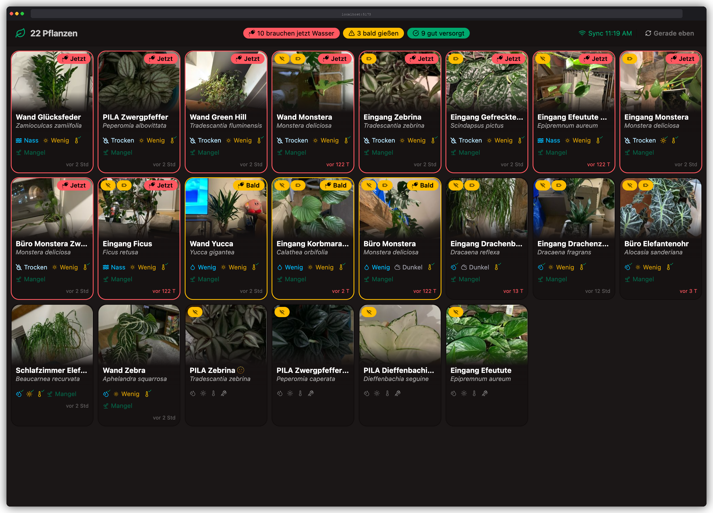

# FYTA Dashboard

A Vue 3 web dashboard for [FYTA](https://fyta.de) plant sensors — displays moisture, light, temperature and nutrient status for all your plants in a responsive, pinch-zoomable card grid.


---



## Features

- **Plant grid** — responsive auto-fill grid sorted by watering urgency
- **Pinch-to-zoom** — pinch gesture scales the grid; zoom persists across sessions
- **Attention model** — plants ranked as *now* / *soon* / *ok* with watering-can badges
- **Photo lightbox** — tap any plant photo to view it full-screen
- **Hub alerts** — banner when a FYTA hub loses its cloud connection
- **Image proxy** — proxies FYTA image URLs so the browser never needs CORS access
- **Docker-ready** — single-container deploy with a built-in Python server

## Prerequisites

| Requirement | Version |
|-------------|---------|
| Node.js | 20+ |
| npm | 10+ |
| Python | 3.11+ (production server only) |
| Docker | any (optional) |

A FYTA API token is required for image proxying. Create one at [web.fyta.de/api-token](https://web.fyta.de/api-token), then store it in `.env.local` (never committed):

```sh
echo "FYTA_API_TOKEN=<your-token>" > .env.local
```

## Development

```sh
npm install
npm run dev        # Vite dev server at http://localhost:5173
```

The dev server does not include the image proxy. Plant photos will fall back to the FYTA plant-species thumbnail when the proxy is unavailable.

Components have [Storybook](https://storybook.js.org) stories — run `npm run storybook` to explore them at port 6006.

## Running the full stack locally

The full stack includes Vite's build output served by a Python server that also proxies FYTA's API and images.

```sh
npm run build

# Option A — source the env file first
set -a && source .env.local && set +a
python3 deploy/server.py
# → http://localhost:8080

# Option B — pass the token inline
FYTA_API_TOKEN=$(grep FYTA_API_TOKEN .env.local | cut -d= -f2) python3 deploy/server.py
```

### Proxy routes

| Path | Upstream |
|------|----------|
| `/api/*` | `https://web.fyta.de/api/*` — REST API (auth forwarded from the browser) |
| `/img-proxy/*` | `https://api.prod.fyta-app.de/*` — plant images (auth via `FYTA_API_TOKEN`) |

## Docker

```sh
# Build
docker build -f deploy/Dockerfile -t fyta-dashboard .

# Run — .env.local is passed as the env-file so the token never appears in shell history
docker run --rm -p 8080:8080 --env-file .env.local fyta-dashboard
open http://localhost:8080
```

The container exits immediately with a clear error message if `FYTA_API_TOKEN` is not set.

## History

<figure>
  
  <figcaption>v1: Home Assistant Lovelace dashboard</figcaption>
</figure>

<figure>
  
  <figcaption>v0: vanilla JavaScript prototype</figcaption>
</figure>

## License

MIT
