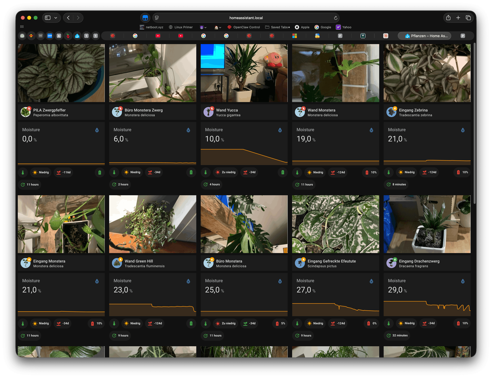
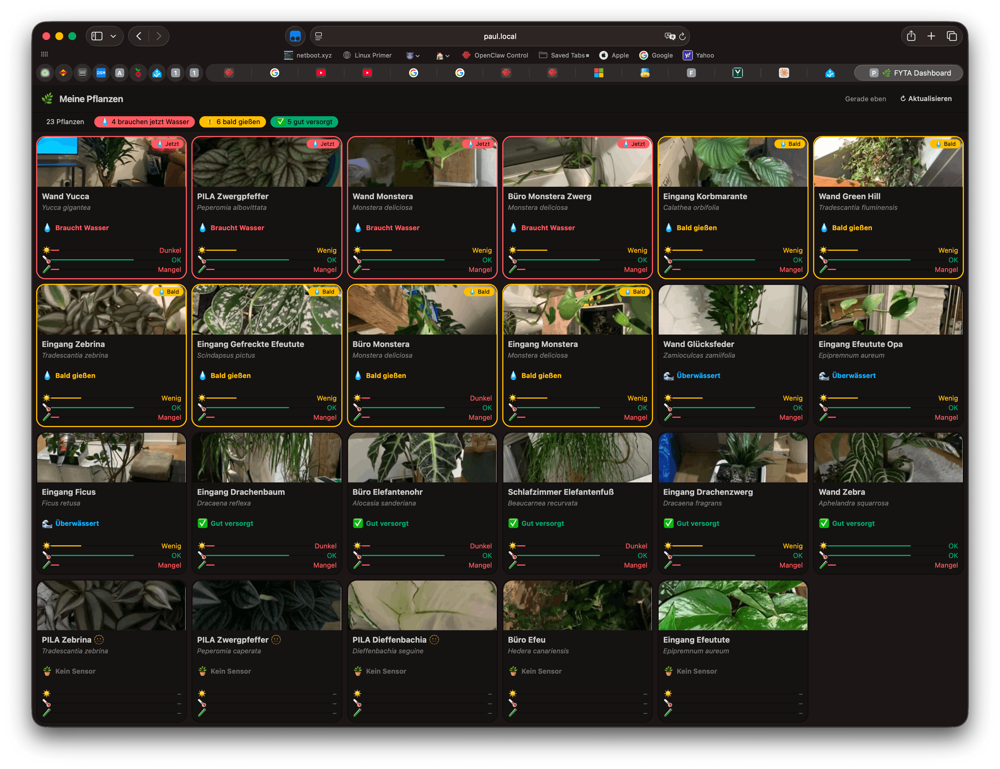

# FYTA Dashboard

A Vue 3 / Vite web dashboard for [FYTA](https://fyta.de) plant sensors.
It serves the built app and proxies two FYTA API endpoints so the browser never needs CORS access to FYTA's servers directly.

| Proxy path     | Upstream                                                                    |
| -------------- | --------------------------------------------------------------------------- |
| `/api/*`       | `https://web.fyta.de/api/*` — REST API (auth forwarded from the browser)    |
| `/img-proxy/*` | `https://api.prod.fyta-app.de/*` — plant images (auth via `FYTA_API_TOKEN`) |

## Prerequisites

An API token is required for image proxying.
Create one at [web.fyta.de/api-token](https://web.fyta.de/api-token), then store it in `.env.local` (never committed):

```sh
echo "FYTA_API_TOKEN=<your-token>" > .env.local
```

## Local development

```sh
npm install
npm run dev          # Vite dev server — no image proxy
```

To run the full stack locally (including the image proxy):

```sh
npm run build
FYTA_API_TOKEN=$(grep FYTA_API_TOKEN .env.local | cut -d= -f2) python3 deploy/server.py
```

Or simply source `.env.local` first:

```sh
npm run build
set -a && source .env.local && set +a
python3 deploy/server.py
# → http://localhost:8080
```

## Docker

### Build

```sh
docker build -f deploy/Dockerfile -t fyta-dashboard .
```

### Run

`.env.local` is passed directly as the env-file so the token never appears in your shell history:

```sh
docker run --rm -p 8080:8080 --env-file .env.local fyta-dashboard
open http://localhost:8080
```

The container fails immediately with a clear error if `FYTA_API_TOKEN` is not set.

## History

<figure>
  
  <figcaption>v1: FYTA dashboard built as Home Assistant dashboard</figcaption>
</figure>

<figure>
  
  <figcaption>v0: FYTA dashboard built using vanilla JavaScript</figcaption>
</figure>
